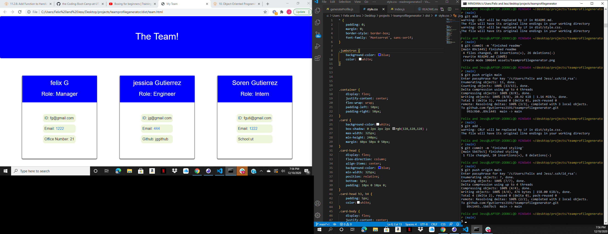

  # Title
  ReadMe Generator

   [A quick video tutorial](<iframe src="https://drive.google.com/file/d/1UkJBkIcxsjO390H73NFpC6eFaQC24keu/preview" width="640" height="480"></iframe>)

  ## Username
  fgutierrez2191

  ## Description
  I used Javascript and Node Js to create a command line application that a Manager could use to generate an html page of his/her team of employees.

  ## Installation
  <li>Fork this repo </li>
<li>Clone it to your machine</li>
<li>Install dependencies </li>
<li>Run 'node index.js' in the terminal</li>

  ## Contributors
  Felix Gutierrez

  ## Technologies
  Javascript, Node.js

  ## License
  undefined

  ## *For Questions*
  contact:[fgutierrez2191@icloud.com]

  Github:[(https://github.com/fgutierrez2191)]

  <h2 id= "screenshots">Screenshots</h2>

